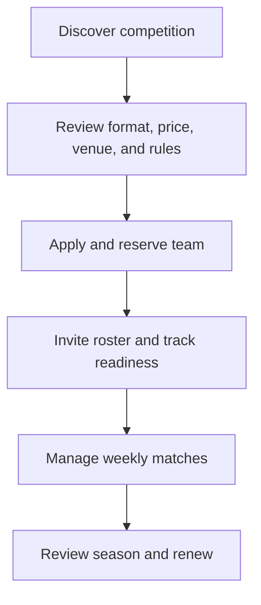
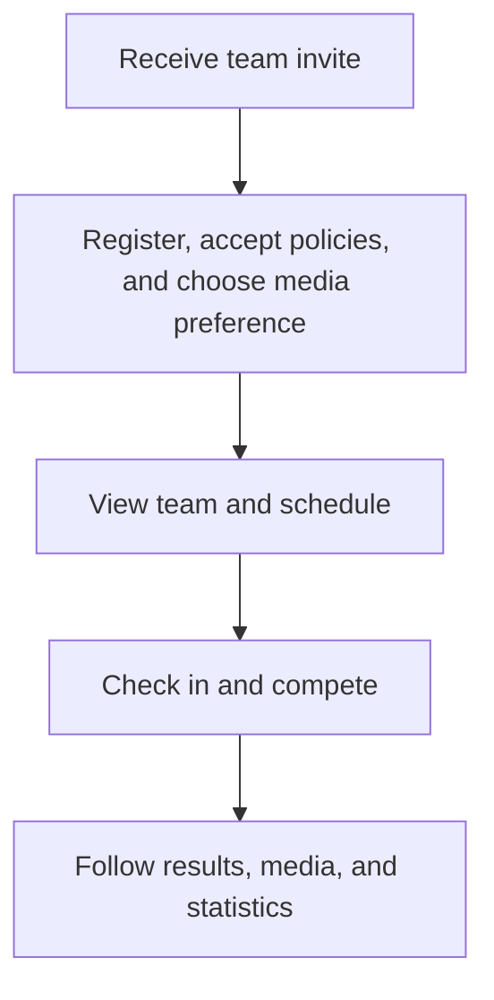
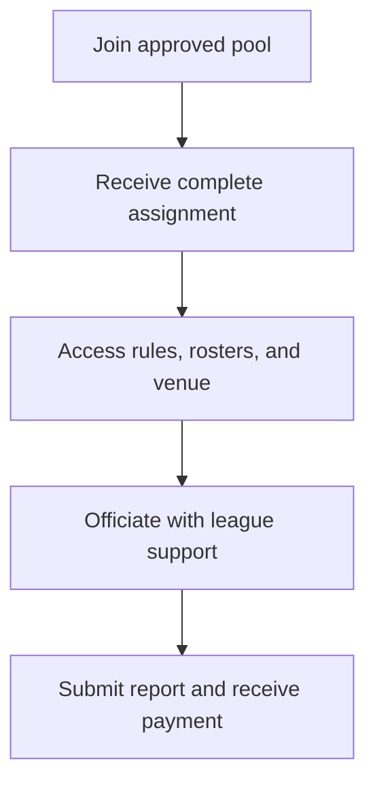

# Brand Strategy and Customer Experience

**Status:** Draft  
**Decision owner:** Brand and commercial lead

## Brand architecture

### Lead identity

**HTX Super League** is the name participants, fans, referees, venues, and sponsors see and interact with.

### Ownership endorsement

Use **“A TRIMNDS Venture”** as a restrained secondary endorsement on:

- About and governance content;
- legal footer and formal notices;
- sponsor/partner decks;
- press releases and corporate announcements;
- recruiting and investment materials.

Do not require the TRIMNDS name to dominate the league crest, score graphics, uniforms, or everyday participant communications. The relationship should create credibility without making HTX Super League feel like a sub-page of another company.

### Legal identity

Contracts, receipts, waivers, and privacy notices must state the correct legal operator and any assumed-name relationship. Brand independence must not obscure who holds customer obligations.

## Brand idea

HTX Super League should make local competition feel consequential without pretending to be professional soccer.

### Proposed purpose

Build the competition Houston teams are proud to play in, follow, and return to.

### Proposed promise

Every match is organized, competitive, and worth showing up for.

### Personality

- competitive, not hostile;
- confident, not inflated;
- local, not exclusionary;
- modern, not gimmicky;
- disciplined, not bureaucratic;
- energetic, not chaotic.

### Voice

Use direct, specific, respectful language. State dates, fees, rules, and actions clearly. Avoid unsupported superlatives, excessive slang, and corporate filler. Do not use “Houston's first,” “number one,” “elite,” “professional,” or “official” unless the claim is defined and supportable.

## Messaging hierarchy

1. What it is: organized Houston 9v9 competition.
2. Who it is for: the approved segment and level.
3. Why it is different: reliable operations, integrity, presentation, and digital clarity.
4. What the season includes: matches, venue, officials, standings, media, playoffs, awards.
5. What to do next: captain interest, team application, player invite, partner inquiry.

## Customer experience principles

### One source of truth

The website/app holds the current schedule, roster status, result, standing, rule, and official notice. Social media attracts and celebrates; it does not replace official communication.

### Make obligations visible

Show every deadline, price component, policy acceptance, roster status, and missing action.

### Design for captains under pressure

Captains organize people and money. Give them a checklist, team status, payment status, roster progress, match reminders, and a clear escalation path.

### Respect officials and opponents

The experience should reinforce that competition quality depends on behavior, punctuality, and fair enforcement.

### Earn attention through real stories

Use actual players, teams, venues, officials, and Houston communities once consent exists. Stock imagery may support pre-launch design but should not misrepresent the league as already operating.

## Stakeholder journeys

### Captain

Critical moments: trust in the offer, payment confidence, roster completion, schedule reliability, and fast issue resolution.

### Player

Critical moments: low-friction registration, safety clarity, accurate identity/eligibility, and recognition.

### Referee

Critical moments: complete information, behavior support, incident response, and predictable payment.

## Service recovery

When HTX makes an error:

1. acknowledge it quickly;
2. state the confirmed impact;
3. assign an owner and next update time;
4. correct the source of truth;
5. provide the remedy allowed by policy;
6. record the cause and preventive action.

Do not erase errors silently or promise exceptions before reviewing competitive and financial effects.

## Language and accessibility

Houston's diversity supports testing bilingual English/Spanish service. At minimum, professionally review translations of eligibility, critical rules, waiver explanation, safety information, payment/refund terms, and urgent notices. Machine translation alone is not sufficient for binding or safety-sensitive text.

Digital products should target WCAG 2.2 AA. Venue information should identify accessible parking, routes, restrooms, spectator areas, and a contact for accommodation requests.

## Visual identity workstream

Before final design:

- complete name, domain, social, and trademark clearance;
- decide whether the master brand uses a crest, wordmark, monogram, or system;
- define color contrast and accessibility requirements;
- build digital, field-signage, apparel, trophy, sponsor-lockup, and social templates;
- test legibility at small sizes and on moving video;
- define team-logo intake and prohibited-content rules;
- define when “A TRIMNDS Venture” appears and its relative scale.

## Experience measures

- captain onboarding completion and time to full roster;
- registration abandonment and support reasons;
- on-time match starts;
- schedule-change comprehension;
- support response and resolution time;
- player perception of safety, fairness, and organization;
- referee perception of support and respect;
- content reach from actual match media;
- sponsor brand-safety incidents and fulfillment;
- team return intent and actual renewal.

