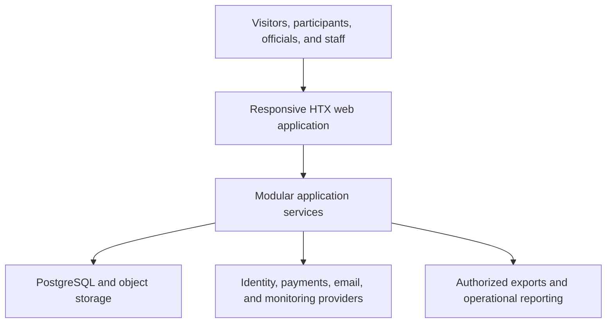
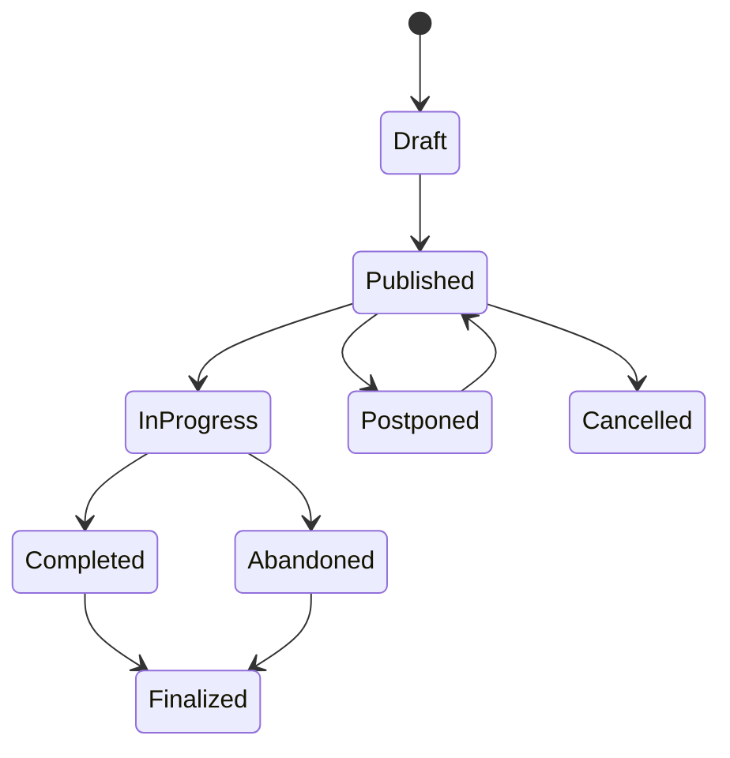
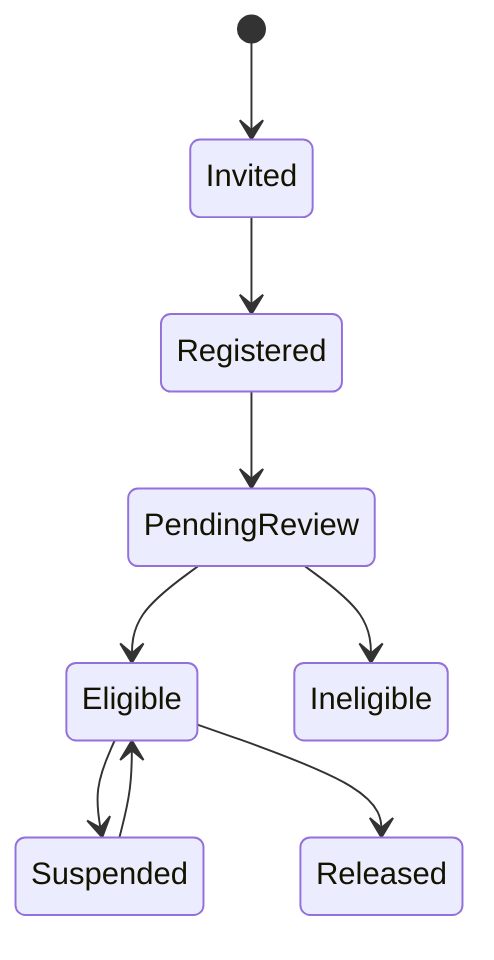

# Data Model and Technical Architecture

**Status:** Draft architecture direction  
**Technical owner:** To be assigned  
**Constraint:** No implementation until the build gate is approved

## Architecture recommendation

Use a TypeScript modular monolith with a responsive web application, relational PostgreSQL database, managed identity, hosted payments, object storage, transactional email, and managed observability. Deploy on a platform that supports preview, staging, production, scheduled work, secure environment variables, and database connectivity. Netlify is a reasonable candidate, but hosting should be selected through an architecture decision after P0 workflows and cost constraints are approved.

This approach supports rapid delivery and consistent transactions without creating premature microservices. Domain boundaries should be explicit in code so high-volume or independently evolving capabilities can be extracted later if evidence requires it.

## System context



The application service is the authority for competition state. Payment providers are authoritative for payment events, identity providers for authentication factors, and signed legal records for their executed content. Integrations must be reconciled rather than assumed consistent.

## Recommended domain modules

| Module | Responsibilities |
|---|---|
| Organization and access | HTX/TRIMNDS operator configuration, users, roles, permissions, environments |
| Competition | Competitions, seasons, divisions, stages, rounds, rules versions |
| Teams and people | Team identity, managers, player profiles, memberships, eligibility |
| Registration and policy | Applications, invitations, roster entries, policy versions, acceptances, readiness |
| Venues and scheduling | Venues, fields, slots, blackouts, fixtures, schedule versions |
| Match operations | Check-in, officials, reports, results, events, status transitions |
| Standings and awards | Table calculation, deductions, qualification, awards and verification |
| Discipline | Incidents, cases, charges, sanctions, suspensions, appeals, evidence references |
| Commerce | Products, prices, charges, discounts, payments, refunds, credits, reconciliation |
| Communications | Templates, recipients, sends, delivery status, notices and preferences |
| Media and partners | Assets, consent/publication state, sponsors, inventory, placements, fulfillment |
| Audit and analytics | Administrative audit trail, domain events, operational metrics, exports |

## Core conceptual data model

### Governance and identity

| Entity | Key relationships and notes |
|---|---|
| Organization | Owns competitions, users, content, and configuration; use `organization_id` to preserve future expansion boundaries |
| UserAccount | Authentication link; distinct from a player, official, or staff profile |
| Person | Minimal shared identity; may have player, official, manager, or staff roles |
| RoleAssignment | User, role, scope, effective dates; supports competition- or organization-scoped access |

### Competition and registration

| Entity | Key relationships and notes |
|---|---|
| Competition | Product definition such as HTX 9v9 League |
| Season | Dated instance with status and policy/rule versions |
| Division | Participant segment and level within a season |
| Stage / Round | Regular season, semifinal, final, and scheduling sequence |
| Team | Persistent identity that may enter multiple seasons |
| TeamEntry | Team participation in a season/division, including application and financial status |
| PlayerProfile | Sport-facing profile separated from private account/contact data |
| RosterEntry | Player, team entry, eligibility status, dates, number, role, roster-lock state |
| PolicyDocumentVersion | Immutable waiver/policy content reference, checksum, effective date, required audience |
| PolicyAcceptance | Person, policy version, timestamp, method, and evidence reference |

### Venues and matches

| Entity | Key relationships and notes |
|---|---|
| Venue / Field | Location, access, surface, dimensions, equipment, accessibility, emergency details |
| FieldSlot | Field, start/end, availability, cost/allocation reference |
| Fixture | Teams, competition context, slot, status, schedule version, public details |
| Match | Played or adjudicated sporting record associated with a fixture |
| MatchRoster | Eligible participants presented for a match |
| MatchOfficialAssignment | Official, role, assignment/confirmation/payment state |
| MatchReport | Referee/submitting authority, score, cards, incidents, submission/finalization state |
| MatchEvent | Goal/card/substitution or other approved event with source and correction history |
| StandingAdjustment | Approved deduction/award with reason, authority, and audit |

### Risk, commerce, and content

| Entity | Key relationships and notes |
|---|---|
| Incident | Safety, conduct, venue, system, or service event; access classified |
| DisciplinaryCase | Charge, subject, evidence references, decision and status |
| Sanction / Suspension | Consequence, scope, effective matches/dates, completion state |
| Appeal | Eligible appellant, grounds, fee, reviewer, outcome |
| Order / Charge | Customer obligation and line items; avoid storing card details |
| PaymentTransaction | Provider identifiers, state, amount, timestamps, reconciliation status |
| Refund / Credit | Policy reason, authorization, provider event, accounting state |
| Discount | Code, rule, budget/owner, eligibility, limits, expiry |
| SponsorAgreement | Commercial summary and secure contract reference |
| SponsorPlacement | Inventory, channel, dates, assets, approval and fulfillment proof |
| MediaAsset | Storage reference, rights owner, subjects, consent state, alt text, publication |
| Notification | Template version, recipient, purpose, channel, delivery and acknowledgement |
| AuditEvent | Actor, action, entity, before/after reference, reason, time, correlation ID |

## Data rules

- Use opaque identifiers; do not expose sequential internal IDs where avoidable.
- Store timestamps as UTC instants and display America/Chicago for the pilot.
- Store money as integer minor units with currency.
- Make policy versions immutable once accepted.
- Preserve source facts for matches; derive standings reproducibly.
- Use database uniqueness and state-transition constraints for rosters, field slots, payments, and eligibility.
- Soft deletion is not a universal answer: define retention, legal hold, anonymization, and true deletion by data class.
- Separate private identity/contact, emergency, finance, discipline, and public profile data through authorization and query design.
- Do not store full identity-document images unless the approved verification process requires it; prefer verification status and provider/reference metadata.

## Key state machines

### Fixture



Transitions require authorized roles and, for material changes, a reason and notification. The exact adjudication paths for abandoned and forfeited matches must match approved rules.

### Roster eligibility



Eligibility is a computed business conclusion based on registration, policy acceptance, payment/coverage, roster rules, and active sanctions; the system should also record the reason.

## Security architecture

- Hosted identity with MFA required for privileged roles.
- Server-side authorization for every protected action; UI hiding is not authorization.
- Scope permissions by organization, competition, team, and job function.
- Use secure, HTTP-only session cookies or an equivalently reviewed token design.
- Encrypt transport; use managed encryption at rest and managed secret storage.
- Apply rate limits, bot controls, upload validation, content-type/size limits, and malware scanning where appropriate.
- Use signed, expiring access to private assets.
- Verify payment and messaging webhooks cryptographically; process idempotently.
- Log privileged access and all changes to results, eligibility, discipline, policy, refunds, roles, and exports.
- Restrict production access and require separate accounts; no shared administrator credentials.
- Define incident response, key rotation, breach assessment, and notification ownership before launch.

## Privacy and retention design

Create a data inventory before implementation with owner, purpose, legal basis as advised, source, audience, sensitivity, retention, and deletion method.

Initial classes:

| Class | Examples | Default handling direction |
|---|---|---|
| Public | Team name, published fixture, result, approved player display name/photo | Explicit publication rules and correction process |
| Internal | Operational notes, vendor records, unpublished schedules | Authenticated staff by need |
| Confidential | Contact details, payments, waiver evidence, discipline | Strong role restrictions, audit, limited exports |
| Restricted | Emergency contacts, serious incident evidence, identity verification artifacts | Very narrow access, encryption, short/legally advised retention |

Do not place restricted data in analytics, logs, support screenshots, issue trackers, or source control.

## Environments and delivery

- Local development uses synthetic data only.
- Preview environments contain no production participant data.
- Staging mirrors production configuration with synthetic or properly de-identified test data.
- Production deployments require reviewed changes, automated checks, migration plan, rollback path, and release owner.
- Feature flags should protect incomplete or operationally risky capabilities.
- Database migrations are versioned and forward/backward deployment compatibility is considered.

## Future repository structure after build approval

```text
apps/
└── web/                 # Public and authenticated responsive application
packages/
├── domain/              # Competition rules, state transitions, standings logic
├── database/            # Schema, migrations, repositories, seed factories
├── ui/                  # Accessible design-system components
├── integrations/        # Identity, payments, email, storage adapters
├── validation/          # Shared schemas and input rules
└── config/              # Lint, formatting, TypeScript, test configuration
infrastructure/
├── environments/        # Non-secret environment/deployment definitions
└── runbooks/            # Deploy, rollback, restore, incident procedures
tests/
├── acceptance/          # Critical business journeys
└── fixtures/            # Synthetic competition scenarios
```

## Testing strategy

- Unit tests for standings, tie groups, eligibility, fees, refunds, and state transitions.
- Property or scenario tests for fixture conflicts and multi-team standings ties.
- Integration tests for database constraints and provider webhooks.
- End-to-end tests for captain application, player registration, payment, schedule change, match result, discipline, and admin correction.
- Accessibility testing with automation and manual keyboard/screen-reader review.
- Security review of authorization boundaries, uploads, exports, session handling, and privileged actions.
- Operational game-day simulation including internet outage and manual fallback/reconciliation.

## Architecture decisions required

Create decision records before implementation for:

1. web framework and deployment platform;
2. PostgreSQL provider and backup/recovery tier;
3. identity provider and user/profile separation;
4. payment processor and merchant/accounting flow;
5. content management approach;
6. object storage and media transformation;
7. transactional email and later SMS strategy;
8. analytics and consent approach;
9. standings calculation and audit design;
10. document/waiver execution and evidence retention;
11. monitoring, security scanning, and incident tooling;
12. monorepo package boundaries and CI/CD.

## Technical build gate

Implementation starts only after the P0 product scope, role matrix, approved rules, data inventory, provider budget, accessibility/security criteria, operating owners, and pilot date are sufficiently stable to prevent software from encoding unresolved business guesses.

